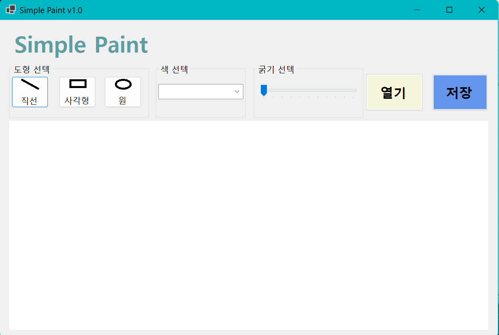
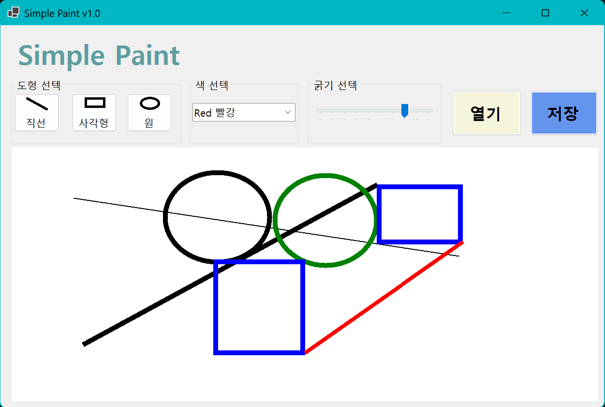
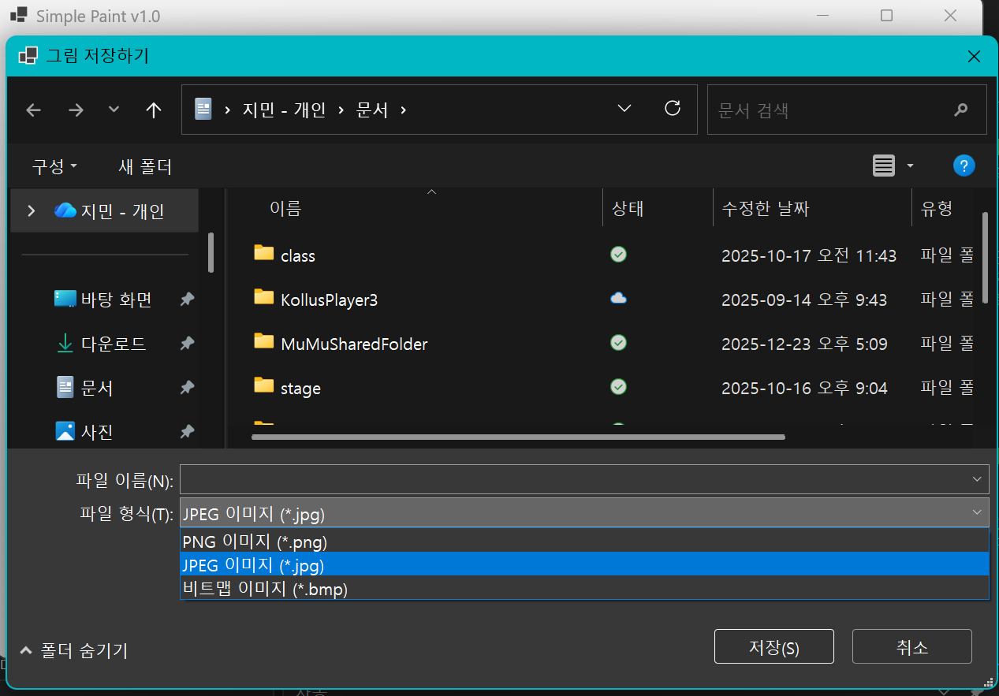

# (C# 코딩) 에코메신저

## 개요
- C# 프로그래밍 학습
- 1줄 소개: 사용자가 원하는 그림을 그리게 하는 프로그램
- 사용한 플랫폼: 
  - C#, .NET Windows Forms, Visual Studio, GitHub
- 사용한 컨트롤: 
  - Label, Button, ComboBox, TrackBar, PictureBox
- 사용한 기술과 구현한 기능: 
  - Visual Studio를 이용하여 UI 디자인
  - Drawing 클래스를 이용하여 그림 그리기

## 실행화면(과제1)
- 코드의 실행 스크린샷과 구현 내용 설명

- 구현한 내용(위그림참조)
  - UI 구성: 도형 선텍, 색 선텍, 굵기 선텍, 캔버스 구성
  - 도형 선텍 : 버튼을 이용해 삽입할 도형(원, 사각형, 직선) 선텍
  - 색 선텍 : ComboBox를 이용해 도형의 색(검정, 빨강, 파랑, 초록) 선텍
  - 굵기 선텍 : TrackBar를 이용해 도형의 굵기 선텍

## 실행화면(과제2)
- 코드의 실행 스크린샷과 구현 내용 설명

- 구현한 내용(위그림참조)
  - 도형 넣기 : 캔버스에 마우스 클릭과 드레그로 도형 삽입
  - 삽입될 도형 표시 : 마우스 클릭과 드레그로 삽입될 도형의 위치와 크기를 점선으로 표시
  - 색과 굵기 적용 : 도형의 색과 굵기를 선텍한대로 적용된 상태로 삽입

## 실행화면(과제3)
- 코드의 실행 스크린샷과 구현 내용 설명

- 구현한 내용(위 그림 참조)
  - 그림 저장 : 캔버스에 그린 그림을 .jpg, .png, .bmp 중 하나의 형식으로 저장

## 실행화면(과제4)
- 코드의 실행 스크린샷과 구현 내용 설명

- 구현한 내용(위 그림 참조)
  - 이미지 불러오기 : 외부 이미지 파일을 캔버스로 불러와서 편집 가능
  - 크기 맞춤 : 이미지의 크기에 맞추어 캔버스의 크기를 조절하며, 이미지가 더 클 경우 스코롤바가 생겨 위치 조정 가능
  - 크기 조절 : 이미지의 크기를 조절하는 기능 추가. (TrackBar 또는 컨트롤 키 + 마우스 휠)